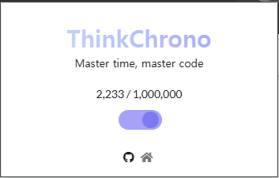
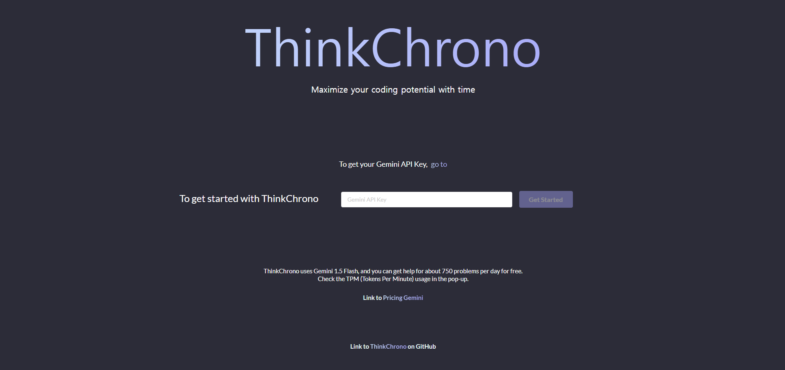
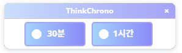
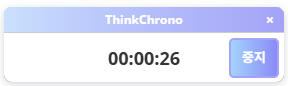

# **ThinkChrono**

## **🚀프로젝트 소개**  
ThinkChrono는 코딩 테스트 준비를 위한 Chrome 확장 프로그램으로, 문제 해결 시간 관리와 AI 기반 문제 해결 접근법 제공에 중점을 둔 혁신적인 도구입니다.

---

## ✨ **주요 기능**

### 1. **타이머 기능**
- 코딩 테스트 문제 해결을 위한 맞춤형 시간 관리
- 타이머 시작, 일시정지, 재개 기능
- 남은 시간 실시간 표시

### 2. **AI 문제 해결 지원**
- 절반 시간과 1/4 시간 지점에 AI 기반 솔루션 제공
- Google Gemini API를 활용한 문제 접근 방법론 제시
- 알고리즘 및 데이터 구조 추천

### 3. **문제 URL 검증**
- 지원되는 코딩 테스트 플랫폼 자동 인식
- 유효한 문제 페이지에서만 기능 활성화

---

## 🛠 **기술 스택**
- **Language**: JavaScript  
- **API**: Chrome Extension API  
- **AI**: Google Gemini API  
- **Frontend**: HTML/CSS  

---

## 📦 **사용 방법**
### 1. **익스텐션 설치**
- [크롬 웹 스토어](https://chromewebstore.google.com/)에서 "ThinkChrono" 설치
### 2. **ThinkChrono 활성화**

### 3. **Gemini API Key 입력**

[Gemini API Key 발급](https://aistudio.google.com/app/apikey) 사이트를 방문해서 key를 발급받고 입력
### 4. **타이머 시간 선택**
 
타이머 "30분" 과 "1시간" 선택(쉬운 난이도는 30분, 어려운 난이도는 1시간 추천)
 
타이머가 동작되면서 선택 시간의 절반이 될 때마다 총 2번 Gemini가 문제 접근법 제공
 
예) 30분 선택 - 15분에 문제 접근법 1차 제공, 7분에 2차 제공